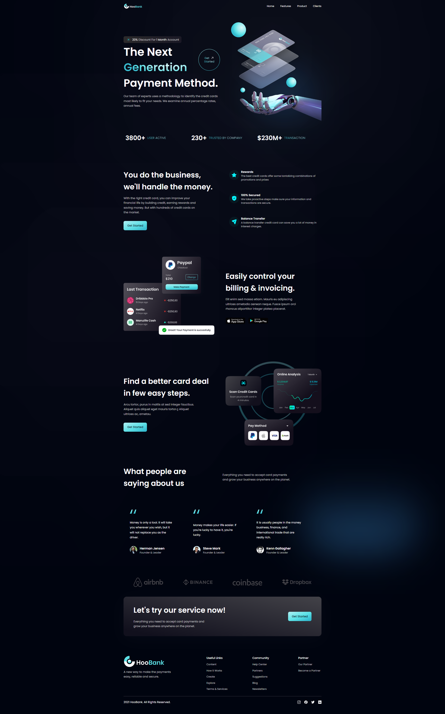

<h1 align="center"> HooBank </h1>

Projeto desenvolvido em React, com base nos ensinamentos do vídeo - [Build and Deploy a Fully Responsive Website with Modern UI/UX in React JS with Tailwind](https://youtu.be/_oO4Qi5aVZs) do canal [@javascriptmastery](https://www.youtube.com/@javascriptmastery) no Youtube. 

<p align="center">
  <a href="#-tecnologias">🚀 Tecnologias</a>&nbsp;&nbsp;&nbsp;|&nbsp;&nbsp;&nbsp;
  <a href="#-projeto">💻 Projeto</a>&nbsp;&nbsp;&nbsp;|&nbsp;&nbsp;&nbsp;
  <a href="#-instruções"> 📋 Instruções</a>&nbsp;&nbsp;&nbsp;|&nbsp;&nbsp;&nbsp;
  <a href="#-layout">🔖 Layout</a>&nbsp;&nbsp;&nbsp;|&nbsp;&nbsp;&nbsp;
  <a href="#memo-licença">📝 Licença</a>
</p>

<br>

<p align="center">
  
</p>

## 🚀 Tecnologias

Esse projeto foi desenvolvido com as seguintes tecnologias:

- [NodeJS](https://nodejs.org/)
- [ReactJS](https://reactjs.org/)
- [Tailwind CSS](https://tailwindcss.com/)


<br>

## 💻 Projeto

O HooBank é um site de um banco fictício, que apresenta os detalhes sobre seus produtos e serviços, base de clientes, quantidade de transaçoes, parceiros, etc, montado a partir de um design criado no Figma, utilizando o framework React, assegurando os benefícios da tecnologia, permitindo que o código seja mais objetivo, reutilizando os componentes comums, garantindo assim um alto desempenho. Vale salientar, que a estilizaçao do projeto foi feita através do Tailwind CSS.


## 📋 Instruções

### Clone o projeto e acesse a pasta.

```bash
$ git clone https://github.com/ThiagoMonts/hoo_bank_app.git
```
```bash
$ cd hoo_bank_app
```

<br>

### Siga o passo a passo:

Instale as dependências
```bash
$ cd hoo_bank_app
```
```bash
$ npm install
```

<br>

Inicie o projeto
```bash
$ npm start
```

<br>


## 🔖 Layout

Você pode acessar o site através [DESSE LINK](https://thiagomonts-hoobank.vercel.app/).

Caso prefira, você pode visualizar o layout do projeto através [DESSE LINK](https://www.figma.com/file/bUGIPys15E78w9bs1l4tgS/HooBank?node-id=310-485&t=fymblf2eMIrz81zV-0).

<br>

## 📝 Licença

Esse projeto está sob a licença MIT.

---

Desenvolvido por [Thiago Honorato](https://www.linkedin.com/in/honoratothiago/)
